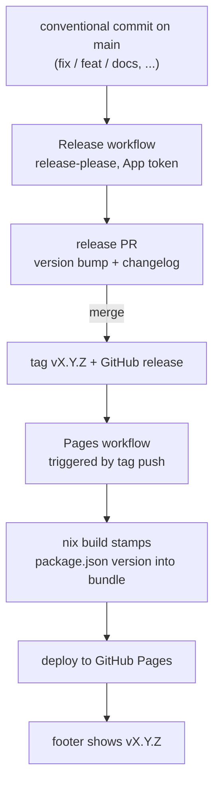

# Release flow

The version shown on the live site traces back to a single conventional
commit on `main`. This diagram follows that value — where it lives at each
hop, from commit message to footer text. See
[Releasing](../dev/releasing.md) for the full mechanics behind each step.

Where the version value lives at each hop:

- **Commit** — no version yet; only the conventional-commit type decides
  whether a release PR bump happens at all.
- **Release PR** — the proposed next version lives in the PR's diff to
  `package.json` and `.release-please-manifest.json`.
- **Tag / GitHub release** — merging the PR turns that proposed version into
  a real `vX.Y.Z` git tag and a published GitHub release.
- **Bundle** — the Pages build reads the version out of `package.json` at
  Nix eval time and stamps it into the JS bundle, replacing the
  `__CSK_VERSION__` placeholder.
- **Footer** — the stamped value renders as `vX.Y.Z` in the live site's
  footer, so what a treasury operator sees always traces back to one tagged
  release.
